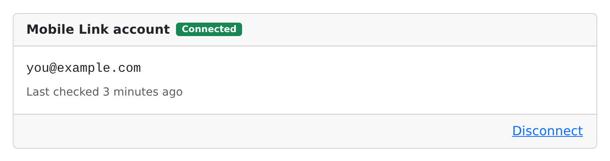
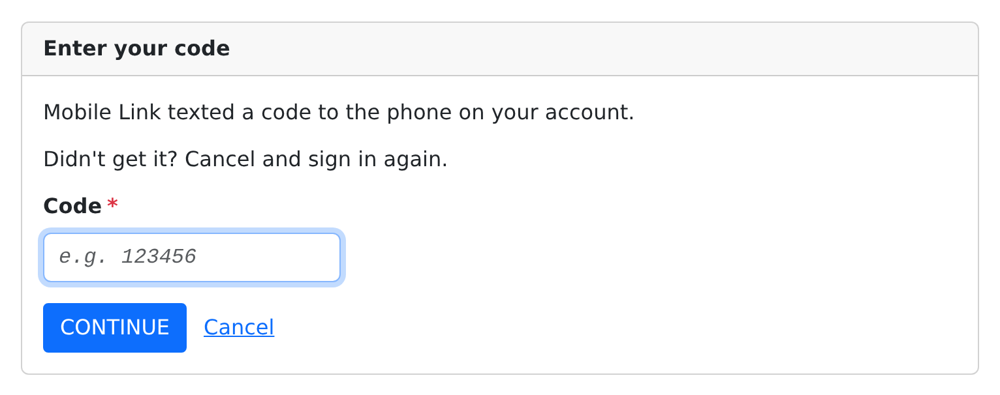
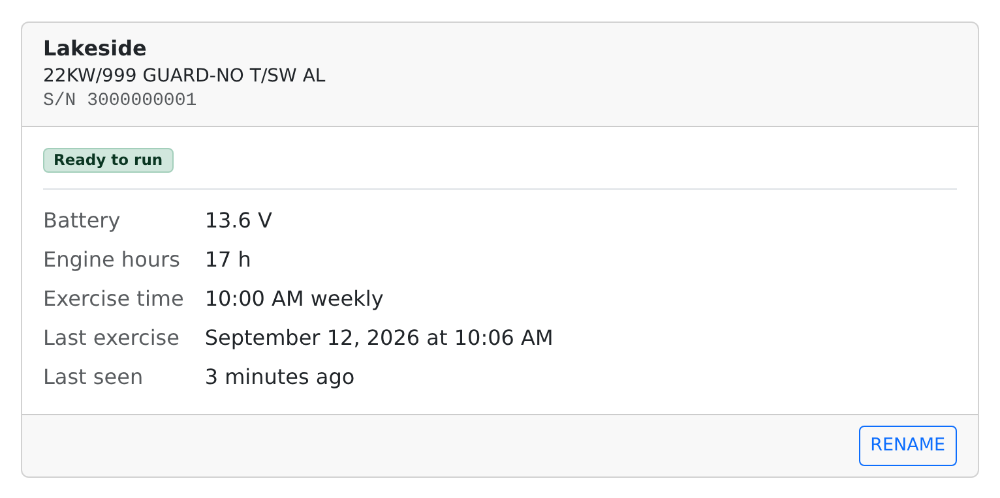
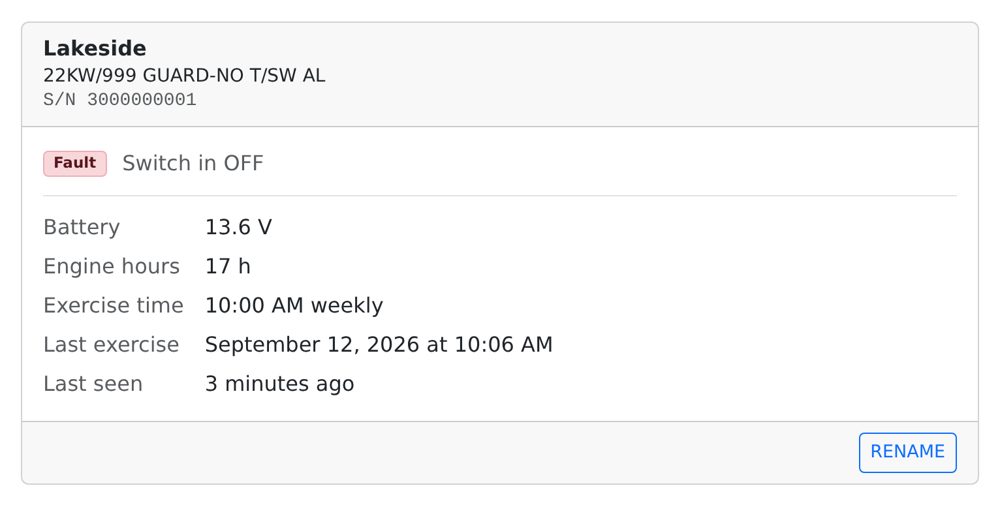
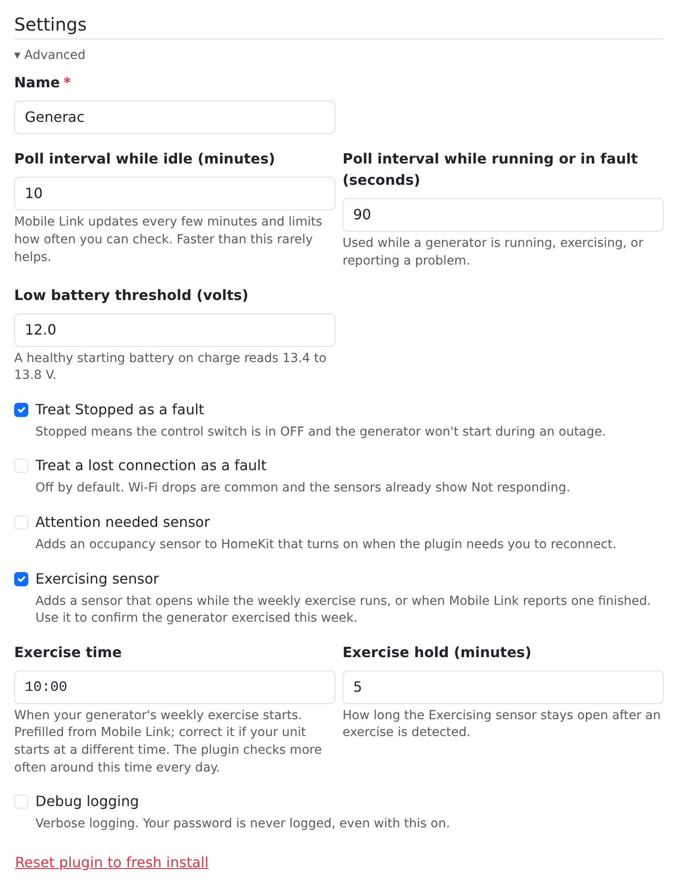

<!--
verified-by-homebridge: this plugin has not been through Homebridge verification yet.
Do not claim it. Once the plugin is verified, replace this comment with the badge:
[](https://github.com/homebridge/homebridge/wiki/Verified-Plugins)
-->

[](https://www.npmjs.com/package/homebridge-generac)
[](https://www.npmjs.com/package/homebridge-generac)
[](LICENSE)
[](https://github.com/arodbuilds/homebridge-generac/actions/workflows/build.yml)

A [Homebridge](https://homebridge.io) plugin that shows the standby generators on your Generac Mobile Link account in the Home app. Each generator appears as a Running sensor, a Fault sensor, a Maintenance Due sensor, an Exercising sensor and a starting battery reading, so you can see at a glance whether the unit is ready, get a notification when it starts or reports a problem, and build automations around it. It is read only and never stores your Mobile Link password.

Not affiliated with or endorsed by Generac Power Systems, Inc. Generac and Mobile Link are its trademarks. Uses Generac's undocumented Mobile Link API, which can change without notice.

> **Status:** 1.0.1, released RELEASE_DATE.

## Contents

- [Requirements](#requirements)
- [Install](#install)
- [Setup](#setup)
  - [1. Connect your Mobile Link account](#1-connect-your-mobile-link-account)
  - [2. Enter the code](#2-enter-the-code)
  - [3. Your generators](#3-your-generators)
  - [4. Settings](#4-settings)
- [What you get in HomeKit](#what-you-get-in-homekit)
- [How it works](#how-it-works)
- [Privacy and what is stored where](#privacy-and-what-is-stored-where)
- [Troubleshooting](#troubleshooting)
- [Development](#development)
- [Credits](#credits)
- [License](#license)

## Requirements

- Homebridge 1.8 or 2.x, with the Homebridge UI for the settings page.
- Node 20, 22 or 24.
- A Generac Mobile Link account with at least one generator on it.
- If the account predates April 21, 2026, a password reset since then. Generac moved Mobile Link sign-in to a new system on that date and did not carry older passwords across, so an older password is rejected until it is reset in the Mobile Link app.

## Install

Search for "Generac" under Plugins in the Homebridge UI and install it, or from a shell on the Homebridge host:

```shell
npm i -g homebridge-generac
```

Then open the plugin's settings from the Plugins page. Everything in the setup below happens on that page. The host's Save button writes config.json and Homebridge restarts the plugin.

## Setup

### 1. Connect your Mobile Link account

Under Mobile Link account, click Connect and enter the email and password you use in the Mobile Link app, then click Sign in. The password is used once for that sign-in and is not stored anywhere.



Once signed in, the card reads Checking until Homebridge picks up the new sign-in, which takes up to a minute and needs no restart, then Connected with the email and when the plugin last checked the account. Disconnect signs the plugin out again.

### 2. Enter the code



Mobile Link sends a code by text message, authenticator app or email, depending on how your account is set up. Type it in and click Continue. A wrong code can be tried three times; after that, or after five minutes, cancel and sign in again. Accounts set up for push, voice or security-key sign-in cannot be completed by the plugin; switch the account to text message or an authenticator app in the Mobile Link app first.

### 3. Your generators



Every generator on the account gets a card within a minute of connecting, with its Mobile Link status, the starting battery voltage, engine hours, the weekly exercise time, the last exercise Mobile Link recorded, and when the unit last reported in. Rename changes the name shown in the Home app; Save keeps it.



When something is wrong the card shows a Fault badge with the reasons Mobile Link gives: the control switch in OFF, active alarms or warnings, an alarm code, a warning status or a lost connection. A unit that has stopped reporting shows Not responding with the time it was last heard from.

### 4. Settings



Settings holds one Advanced disclosure:

- Name: the plugin name in Homebridge logs.
- Poll interval while idle (minutes) and Poll interval while running or in fault (seconds): how often the plugin checks Mobile Link, see [How it works](#how-it-works).
- Low battery threshold (volts): the voltage at or below which the Battery service reports low. The default is 12.0 V; a healthy starting battery on charge reads 13.4 to 13.8 V.
- Treat Stopped as a fault: on by default. Stopped means the control switch is in OFF and the generator will not start during an outage.
- Treat a lost connection as a fault: off by default. Wi-Fi drops are common and the sensors already show Not responding.
- Attention needed sensor: an occupancy sensor that turns on while the plugin needs you to reconnect, for an automation that sends you a notification.
- Exercising sensor: on by default, see [What you get in HomeKit](#what-you-get-in-homekit).
- Exercise time: when the weekly exercise starts, prefilled from Mobile Link. Correct it if your unit starts at a different time.
- Exercise hold (minutes): how long the Exercising sensor stays open after an exercise is detected.
- Debug logging: verbose logging. The password is never logged, even with this on.
- Reset plugin to fresh install: signs out, removes every generator from the Home app on the next restart, and clears the settings.

## What you get in HomeKit

One accessory per generator, named after the generator, with these services:

| Service | Kind | Open (or on) when |
| --- | --- | --- |
| Running | Contact sensor | The engine is running. |
| Fault | Contact sensor | Mobile Link reports a Warning status, an active alarm or warning, or an alarm code; the control switch is in OFF (Treat Stopped as a fault); or the unit lost its connection (Treat a lost connection as a fault, off by default). |
| Maintenance Due | Contact sensor | Generac flags service as due. |
| Exercising | Contact sensor | The weekly exercise is running, or Mobile Link reports one finished since the last check. |
| Battery | Battery service | Always present: the starting battery voltage as a level (11.8 V is 0 percent, 12.8 V is 100 percent) and the low battery flag at or below the threshold. |

Optionally, one Attention needed occupancy sensor for the plugin, on while the plugin cannot sign in.

**Why contact sensors and not a switch.** A switch in the Home app invites you to flip it, and this plugin cannot start, stop or exercise a generator; no command endpoint has been validated and the plugin stays read only. Contact sensors say exactly what they mean, show open and closed in the Home app, and are what HomeKit automations trigger on. In Automations, choose a sensor and pick what should happen when it opens and when it closes: turn on a light when Running opens, send a notification when Fault opens.

**The Exercising sensor.** Standby generators run themselves for a few minutes every week. The sensor opens when a check sees the unit exercising, and also retroactively: Mobile Link records the finished exercise with a timestamp, so an exercise the plugin slept through is still detected on the next check and opens the sensor then. The sensor stays open for the exercise hold time after the last detection. Use it to confirm the generator exercised this week, for example with an automation that notifies you if it has not opened by Saturday evening.

**Notifications.** For the Fault sensor, turn on notifications in the Home app and allow them as Critical Alerts, so a fault gets through Do Not Disturb and a Focus. That is the one notification worth having from this plugin.

Every sensor also reports Status Active, which is off while the unit is not responding or the plugin cannot reach Mobile Link, and Status Fault, which follows the Fault sensor. Names you give the sensors in the Home app are kept.

## How it works

- **Polling.** While every generator is ready and quiet the plugin checks Mobile Link every 10 minutes (Poll interval while idle, minimum 2). While any generator is running, exercising or in fault it checks every 90 seconds (Poll interval while running or in fault, minimum 60). Mobile Link itself updates every few minutes and limits how often an account can be checked, so faster settings rarely help.
- **The exercise watch window.** Around the exercise time, from 10 minutes before it until 20 minutes after it, every day, the plugin checks at the faster interval so a live exercise is likely to be seen rather than only detected afterwards. The window opens early because Mobile Link can report a slightly later time than the one the generator keeps: one unit starts at 10:00 while Mobile Link says 10:05, so the prefilled time still covers the start.
- **Backoff.** When a check fails, the plugin waits longer between tries, doubling from the fast interval up to 30 minutes with some jitter. After three failures in a row the sensors show Not responding until a check succeeds.
- **Sign-in.** The plugin signs in once, from the settings page, and keeps only a refresh token. Access tokens are refreshed shortly before they expire; the plugin never signs in again on its own and never needs the password after the first time.
- **After a password change.** Changing the Mobile Link password revokes the refresh token. The plugin then enters Reconnect needed: it logs once, marks the sensors as not responding, turns the Attention needed sensor on if enabled, and retries hourly in case access comes back. Click Reconnect on the settings page and sign in again; nothing else changes.
- **Configuration.** The settings page writes the platform block in config.json; the shape and every default are in [SPEC.md](SPEC.md) section 9 and in `config.schema.json`, for anyone who edits by hand.

## Privacy and what is stored where

- The sign-in lives in `homebridge-generac/credentials.json` inside the Homebridge storage folder, with mode 600, readable only by the Homebridge user. It holds the account email, the refresh token and the key the token is bound to. It is never written to config.json, the log or the settings page.
- The password is never stored. It is used once to sign in from the settings page (or the `homebridge-generac login` command) and then forgotten.
- `homebridge-generac/state.json` holds what the settings page shows: the account state, each generator's last status, and when the plugin last checked. No tokens.
- With Debug logging on, every status change writes the raw Mobile Link payload for the generator to `homebridge-generac/captures/`, keeping the newest 10, so a real payload can be shared as a test fixture. Captures never contain tokens.
- `homebridge-generac/debug/` exists only if you ran `homebridge-generac login --debug` and a sign-in step failed. It holds the page Mobile Link's sign-in service returned, with codes, state and tokens replaced by REDACTED (mode 600). Without `--debug`, the command writes no such file, and it never writes to the folder you run it from.
- The log never contains passwords, tokens, keys or one-time codes, at any log level.
- Nothing is sent anywhere but Generac. The plugin talks to Generac's sign-in service and the Mobile Link API and to nothing else.
- To remove everything, use Reset plugin to fresh install on the settings page, or delete the `homebridge-generac` folder in the Homebridge storage folder.

## Troubleshooting

- **"Mobile Link rejected that password."** If you have not reset the password since April 21, 2026, reset it in the Mobile Link app, then try again. Older passwords were not carried across Generac's security update.
- **"Mobile Link doesn't recognize that email."** Use the email you sign in with in the Mobile Link app.
- **"Your account uses a sign-in method this plugin can't complete."** The account is set up for push, voice or security-key sign-in. In the Mobile Link app, switch to text message or an authenticator app, then try again.
- **"Couldn't reach Mobile Link."** The Homebridge host could not reach Generac's sign-in service. Try again in a minute.
- **The card stays on Checking.** Homebridge picks up a new sign-in within a minute without a restart. If the card has not changed after two minutes, restart Homebridge from Power Options.
- **Reconnect needed.** Mobile Link signed the plugin out. This happens after a password change or if Generac revokes access. Click Reconnect and sign in again; the generators and their sensors stay as they were. The Attention needed sensor, if enabled, is on until you do.
- **Not responding.** The generator has not reported to Mobile Link recently (a Wi-Fi drop is the usual cause), or the plugin has not been able to reach Mobile Link for three checks in a row. The card shows when the unit was last heard from; the sensors report Status Active off and keep their last values. It is not a fault unless Treat a lost connection as a fault is on.
- **No generators yet.** They appear within a minute of connecting. If the account holds only a propane tank monitor or a linked ecobee thermostat, the settings page says so under Generators: tank monitors are not supported, and ecobee thermostats are already native HomeKit devices and are skipped.
- **The generator exercised but the sensor did not open.** The sensor also opens retroactively when Mobile Link records the finished exercise, usually within the next idle poll. Check Exercise time under Advanced; the plugin checks more often around that time every day.

## Development

Node 20, 22 or 24. Clone the repository, then:

```shell
npm ci
npm test
```

`npm test` lints, builds and runs the node:test suites in `test/`. Tests never touch the network: `fetch` is mocked and the Mobile Link answers come from the fixtures under `test/fixtures/`. `npm run lint` and `npm run build` run the parts on their own.

To try a build on a Homebridge host, symlink the clone into the global plugin path, for example `ln -s ~/homebridge-generac "$(npm root -g)/homebridge-generac"`, then restart Homebridge. The settings page is TypeScript under `homebridge-ui/src/`, compiled to `homebridge-ui/public/js/` by the build; its server side is compiled from `src/ui/` and started by `homebridge-ui/server.js`. [SPEC.md](SPEC.md) is the source of truth for behaviour, naming, configuration and the page's copy.

The `homebridge-generac status` command prints the account and generator state from a terminal, and `homebridge-generac login` signs in without the settings page:

```shell
homebridge-generac login [--out file] [--debug]
homebridge-generac status [--creds file]
```

Run `login` as the user Homebridge runs as, so the credentials land in `homebridge-generac/credentials.json` in its storage folder (or at `--out`). The redirects it prints show their shape only: the sign-in code, state and any token read `REDACTED`. When a sign-in step fails, `login` prints the step, the HTTP status and the sign-in service's error code. Add `--debug` to also save the page that step returned, redacted the same way, to `homebridge-generac/debug/<step>-<status>.html` next to the credentials (mode 600), for a bug report. Nothing is written to the folder you run it from.

## Credits

Generac's Mobile Link API is undocumented, and this plugin stands on work that mapped it before:

- [ha-generac](https://github.com/binarydev/ha-generac) (Apache-2.0): the Auth0 and DPoP sign-in sequence in `src/auth.ts` is ported from its auth module, the Auth0 flow by sslivins and the code-challenge handling by pjordanandrsn, as recorded in [NOTICE](NOTICE).
- [homebridge-mobilelink](https://www.npmjs.com/package/homebridge-mobilelink) by Nicholas Penree (Apache-2.0): the original HomeKit bridge for Mobile Link, of which this plugin is the successor.

Beyond the ported sign-in sequence, no code is shared with either project.

Built by Alex Rodriguez. If this plugin is useful to you, say hello at [alex-rodriguez.com](https://alex-rodriguez.com/?ref=generac#building).

## License

Apache-2.0. Copyright 2026 Alex Rodriguez (arodbuilds).
